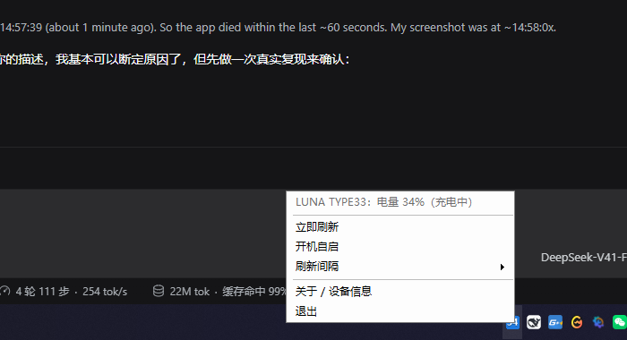

# LunaBatteryTray

**中文** | [English](README.en.md)

在 Windows 任务栏托盘里显示 **Lunafury LUNA TYPE33**（`Luna33-W`）无线鼠标的电量。


鼠标：USB VID `0x373E`，PID `0x0032`（有线）/ `0x0033`（8K 2.4G 接收器）。
单个 exe、零依赖、不需要装官方驱动。

- 图标上直接写电量数字：≥50% 绿 / 20–49% 橙 / <20% 红 / **充电中蓝**（图标较大时右下角带闪电）
- 悬停显示 `LUNA TYPE33：电量 32%（充电中）`
- 识别到设备但无线链路没起来 → 紫色 `?`；没插 → 灰 `--`
- 右键菜单：立即刷新 / 开机自启 / 刷新间隔 / 关于 / 退出

## 快速开始

1. 下载或编译 `LunaBatteryTray.exe`
2. 双击运行，图标出现在任务栏右下角（若被收进 `^` 溢出区，拖出来即可）
3. 想开机自启：右键图标勾「开机自启」，或双击 `tools\启用开机自启.cmd`

## 编译

需要 .NET Framework 4.x（Windows 自带），无需 Visual Studio：

```cmd
build.cmd
```

等价于：

```cmd
%WINDIR%\Microsoft.NET\Framework64\v4.0.30319\csc.exe /target:winexe /optimize+ ^
  /out:LunaBatteryTray.exe ^
  /r:System.dll /r:System.Windows.Forms.dll /r:System.Drawing.dll ^
  src\LunaBatteryTray.cs
```

## 命令行

```
LunaBatteryTray.exe --probe                    只读一次并打印结果，然后退出
LunaBatteryTray.exe --interval 60              启动托盘，60 秒刷新一次（默认 30）
LunaBatteryTray.exe --enable-autostart         开启开机自启
LunaBatteryTray.exe --disable-autostart        关闭开机自启
LunaBatteryTray.exe --render-icon out.png      导出当前图标 PNG（16/24/32/64 四种尺寸）
```

日志：优先 `%LOCALAPPDATA%\LunaBatteryTray\state.log`，不可写时回退到 `程序目录\logs\`，
再回退到 `%TEMP%\LunaBatteryTray\`。`--probe` 的结果也会写到同目录的 `probe.txt`。

## 项目结构

```
LunaBatteryTray.exe            主程序（23 KB，提交进仓库方便直接下载）
build.cmd                      一键编译
src/LunaBatteryTray.cs         完整源码（C# 5，单文件）
tools/启用开机自启.cmd         备用开机自启开关（菜单报错时用）
tools/取消开机自启.cmd
images/                        截图与图标预览
.github/workflows/build.yml    CI：每次 push 用 csc 编译并上传 artifact
```

---

## 原理：电量是怎么读出来的

**Windows 自己不提供**这只鼠标的电量。它不是蓝牙设备（`Get-PnpDevice -Class Battery` 里没有它，
蓝牙那套 `DEVPKEY_Bluetooth_Battery` 属性也用不上），走的是 2.4G 接收器 / USB 线，
所以没有任何通用 API，只能直接跟厂商的 HID 私有通道对话。
（同类工具如 HaloBattery、mouse-battery-tray 也都是一样：2.4G 设备各写一个 HID provider，
只有蓝牙才走系统属性。）

这个鼠标的接口布局（本机实测）：

```
USB\VID_373E&PID_0032   "Luna33-W"  有线模式
  ├─ MI_00  HID mouse
  ├─ MI_01  多个 vendor collection（键盘/多媒体/厂商自定义）
  └─ MI_02  usage page 0xFFFF, usage 0x00  → 65 字节 feature report  ← 命令通道
USB\VID_373E&PID_0033   "Luna33-W"  2.4G 接收器
  └─ MI_02  同上，65 字节 feature report
```

协议（**真机验证通过**）：

```
发送 feature report (65 字节)：
  00 00 00 02 02 00 83 00 00 ... 00

读取 feature report (65 字节)：
  索引: 0  1  2  3  4  5  6  7   8
  内容: 00 A1 00 02 02 00 83 充电 电量%
```

* 第 1 字节 `0xA1`（或 `0xA2`）= 应答有效；**`0xA0` 表示无线链路没起来**
  （例如鼠标插着线、没在用 2.4G），此时不能当成 0%。
* 第 7 字节 = 充电标志，第 8 字节 = 电量百分比。
* 程序扫描**所有 VID `0x373E` 且 usage page 为 `0xFFFF` 的接口**，逐个发这条命令取第一个有效读数 ——
  插线用、用接收器、两个同时插着都能正确显示。

本机实测记录：

| 接口 | 返回 | 解读 |
|---|---|---|
| PID_0032（有线） | `00 A1 00 02 02 00 83 01 1D` | 充电中，电量 `0x1D` = **29%** |
| PID_0033（接收器） | `00 A0 00 02 02 00 83 00 00` | 无线链路未激活 → “无线未连接” |

程序只写这一条查询命令，不会改动鼠标的任何设置。

### 与官方网页驱动的交叉验证

官方网驱是 `https://mouse.lunafury.games/`（“Lunafury Drive”，WebHID 实现）。
反解它的 `/js/output.xvi3.min.js` 后，**电量读法与上面完全一致**：

```js
async getBatPer() {
  var t = new Uint8Array(64), a = new Uint8Array(64);
  t[2] = 2; t[3] = 2; t[5] = 131;          // 131 = 0x83
  await this.setReport(t);                  // sendFeatureReport(0, t)
  await this.mySleep(200);                  // 官方等 200ms
  var e = await this.getReport(a);          // receiveFeatureReport(0)
  if (e[1] == 161 && e[4] == 2 && e[6] == 131) return [e[7], e[8]];  // 161 = 0xA1 → [充电, 电量]
  if (e[0] == 161 && e[3] == 2 && e[5] == 131) return [e[6], e[7]];  // 应答里被去掉 report id 的情况
  return [0, 0];
}
```

| | 官方网驱 | 本工具 |
|---|---|---|
| 通道 | `sendFeatureReport(0, 64B)` / `receiveFeatureReport(0)` | `HidD_SetFeature` / `HidD_GetFeature`，65 字节（含 report id 0） |
| 命令字节 | `t[2]=2, t[3]=2, t[5]=0x83` | 同样发 `00 00 02 02 00 83`（同一位置，差一个 report id 前缀） |
| 应答判定 | `e[1]==0xA1 && e[4]==2 && e[6]==0x83` | 同 |
| 取值 | `[e[7], e[8]]` = [充电, 电量%] | 同（也兼容被去掉 report id 的错位排布） |
| 等待 | 写后 200ms | 写后 200/250/400ms 三次重试 |

官方网驱的设备表（`app.14b76f96.js` 里的 LUNA33 配置）也印证了接口划分：

```
"UIFolder":"LUNA33", "VIDWired":"373E", "PIDWired":"0032",
"VIDWireless4K8K":"373E", "PIDWireless4K8K":"0033", "IsNewProtocol":"1"
```

即 **有线 = 373E:0032，8K 接收器 = 373E:0033**，正是本工具自动扫描的两个接口。
（唯一差别：官方在有线模式下会把命令第 3 字节的 `2` 换成 `wiredMouseDeviceID`（默认 0）；
本工具保留 `2`，真机有线模式实测一样能正确返回，两种写法设备都接受。）

> 官方 JS 是厂商版权代码，**没有**收录进本仓库；想核对请自行打开网驱页面抓取 `assets/output.*.js`。

---

## 已知限制

* 鼠标必须**有线插着**，或者**接收器插着且鼠标已开机并连上 2.4G**；都没有时显示 `--`。
* 鼠标睡着（省电休眠）时接收器可能回 0 或旧值，此时显示紫色 `?`，而不是假的 0%。
* 目前只针对 LUNA TYPE33 调过。换别的同 VID（`0x373E`）鼠标，理论上改 `LunaHid` 里的
  VID/usage page 即可，欢迎提 issue 附上 `--probe` 输出。

## 更新记录

**v1.1 — 修掉“一右键就消失”**

托盘在屏幕右下角时，`NotifyIcon.ContextMenuStrip` 默认让菜单**向上弹**，弹出的菜单正好把光标
压在最后一项「退出」上。于是右键打开菜单后，紧接着的任何一次点击（哪怕只是想点掉菜单）
都会点到「退出」，程序正常退出、图标消失 —— 事件日志里因此没有任何崩溃记录。实测复现：

```
pid before right-click : 23936
pid after  right-click : 23936   ← 右键本身没事
left-clicking at (1475,1061) ... ← 光标正压在「退出」上
pid after  left-click  : GONE
```



改法：不再用 `ContextMenuStrip` 的默认定位，改由 `ShowTrayMenu()` 自己算坐标，
让菜单整体落在光标之外的工作区内。修复后同样操作：

```
menu shown at (1231,892) size 256x148   pointer (1475,1061)   pointerInsideMenu=False
pid after left-click   : 23204          ← 还在
```


菜单弹出坐标会记进 `state.log`，方便日后核对。

**v1.0** — 首个版本：真机逆出 65 字节 feature 协议并用官方网驱交叉验证。

## 参考的同类开源项目

同类鼠标的电量读取没有通用方案，都是各自逆协议。本实现为独立编写（协议事实与厂商网驱交叉核对），
思路与文档格式参考了这些 MIT 项目：

* [incconutwo/mouse-battery-tray](https://github.com/incconutwo/mouse-battery-tray) —— 托盘图标画百分比、WLMouse 族协议
* [HeyOkay/HaloBattery](https://github.com/HeyOkay/HaloBattery) —— 65 字节 feature 通道的通用套路（`charge==0` 视为链路未建立）
* [maxboeer/attackshark-battery-bridge](https://github.com/maxboeer/attackshark-battery-bridge) —— 同为 VID `0x373E` 的 `00 00 00 02 02 00 83` 报文与 `raw[8]`/`raw[7]` 偏移
* [ryanlewis/mousebatt](https://github.com/ryanlewis/mousebatt)、[stuffz/mouse-battery-monitor](https://github.com/stuffz/mouse-battery-monitor) —— 纯 Win32 `HidD_Get/SetFeature` 的写法与协议文档格式

## 许可

[MIT](LICENSE)。
